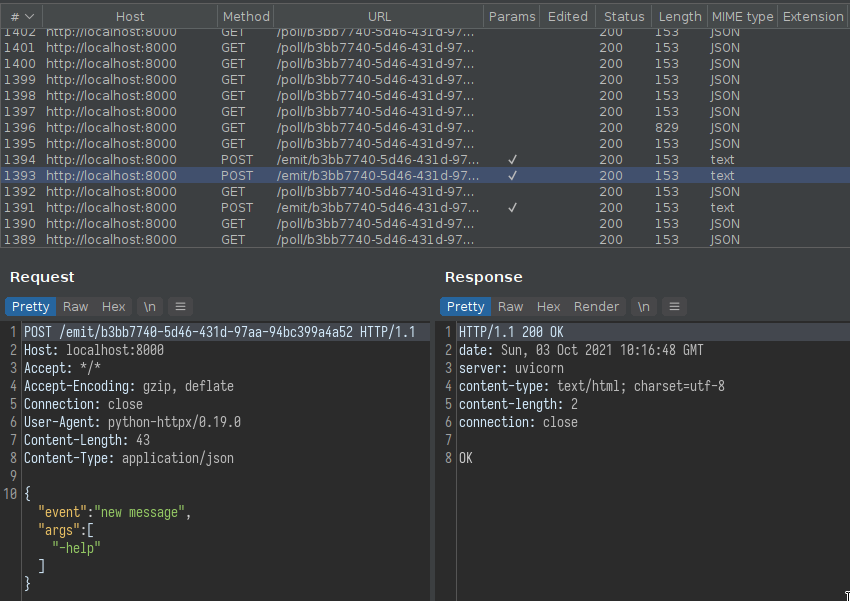

# SocketIO Interceptor

SocketIO Interceptor is a small python script that can be used for intercepting SocketIO traffic using a regular man-in-the-middle proxy.

The proxy does not need to support the decoding of SocketIO traffic or intercepting websockets as the script will translate SocketIO messages into ordinary REST api calls.

Additionally the script can be used as a websocket client through the exposed REST api interface.

## Installation

It is best to use a virtual environment for running this script as the supported SocketIO version is dependent on the version of the python-socketio module. The requirements.txt file included with the project installs a version which is compatible with most EngineIO / SocketIO versions.

See https://python-socketio.readthedocs.io/en/latest/intro.html#version-compatibility for more details on what version to install.

The required modules can be installed using pip:

```shell
python3 -m pip install -r requirements.txt
```

## Running

To successfully intercept traffic, you must set up your interception proxy to redirect connections to the sio-intercept listener. This can be done in many ways, however the most supported method is to replace the SocketIO connection URL in the JavaScript code fetched from the target site and to set up replacement rules to bypass the same origin policy.

For example to intercept traffic from the socketio demo chat
application, you need to:
- Replace `var socket = io();` with `var socket = io("http://localhost:8000");` in the response body
- Replace `Origin: https://socketio-chat-h9jt.herokuapp.com` with `Origin: http://localhost:8000` in the request headers
- Replace `Access-Control-Allow-Origin: http://localhost:8000` with `Access-Control-Allow-Origin: https://socketio-chat-h9jt.herokuapp.com` on the response headers

The first replacement rule redirects the traffic to the sio-intercept listener. The actual replacement rule may be slightly different, depending on how the application connects to the SocketIO server.

The 2nd and 3rd replacement rules are used for bypassing the same origin policy. If the client is not connecting, check your browser's developer console for any errors.

Next start the sio-intercept script with the appropriate options.

```shell
python sio-intercept.py --help
Usage: sio-intercept.py [OPTIONS]

Options:
  --listen-host TEXT              [default: localhost]
  --listen-port INTEGER           [default: 8000]
  --mitm-proxy TEXT               [default: http://localhost:8080]
  --sockio-url TEXT               [default: https://socketio-
                                  chat-h9jt.herokuapp.com]
  --cookie-mode / --no-cookie-mode
                                  [default: no-cookie-mode]
  --help                          Show this message and exit.
```

If everything is set up correctly, you should see the SocketIO messages in your interception proxy:



## Options

The `listen-host` and `listen-port` are used to set the listening address for the SocketIO and RestAPI servers. Generally you can leave the default setting.

The `mitm-proxy` setting is used to specify the listening host/port for your interception proxy.

The `sockio-url` parameter must be set to the correct SocketIO url for the target application.

The `--cookie-mode / --no-cookie-mode` flag specifies whether to pass the session id in a cookie or not. Enabling cookie mode can be useful to keep certain application scanners in session.

Proxy settings for posting intercepted traffic (`/emit` and `/poll`) requests) will be loaded from the `http_proxy` and `https_proxy` environment variables.

## REST api interface

The script implements a simple REST api interface, with the following methods:

- GET `/connect`: Connect to the specified SocketIO endpoint and return a session identifier

- GET `/disconnect/<SID>`: Disconnect from the session identified by SID

- POST `/emit/<SID>`: Send the SocketIO event specified in the POST body to the session identified by SID. The POST body must contain a JSON object with the following fields: `{"event": "event-name-to-emit", "args": ["event-args-to-emit"]}`

- GET `/poll/<SID>`: Poll for new events received for the session identified by SID
